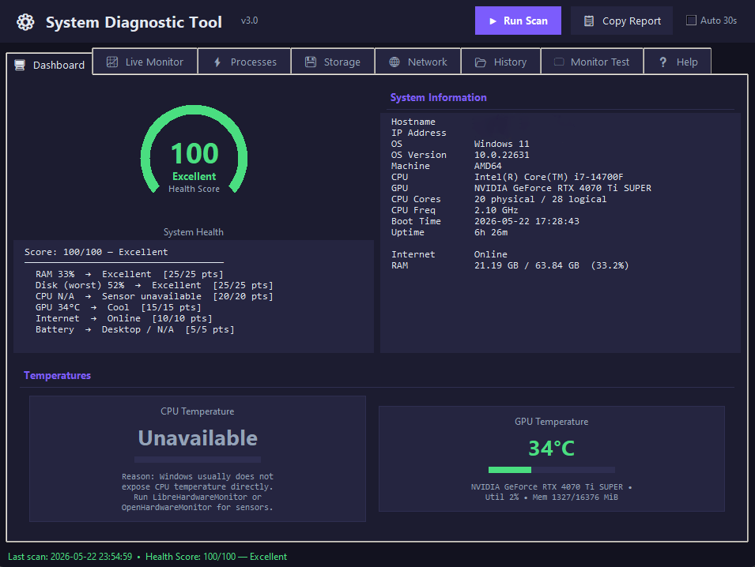
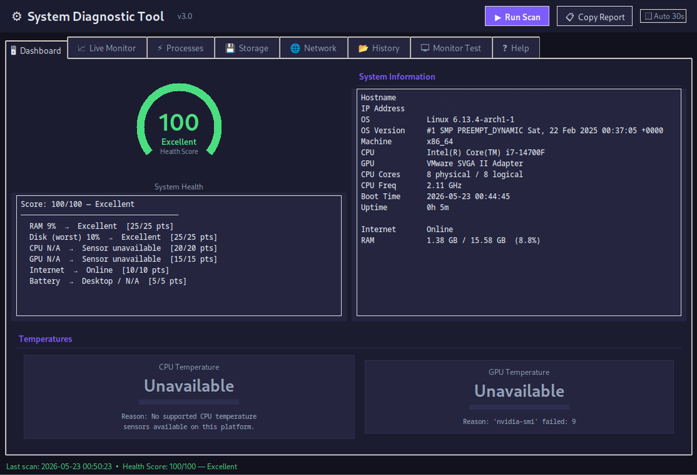

# System Diagnostic Helper

A Windows‑friendly Python desktop app that checks common system health information and generates readable diagnostic reports. I built it to feel like a practical helper for basic troubleshooting rather than just a stats dump. It uses a simple Tkinter GUI, works without admin rights in most cases, and aims to explain results in a way that makes sense if you are doing IT support work.

## Why I built this
I'm working on my IT support and Python skills and wanted a tool that looks and behaves like something I would actually use when helping someone fix a slow or misbehaving PC. Building this helped me practice reading system data safely, presenting it in a clean UI, and exporting reports that are useful for a quick handoff or documentation. This will, however, not scan for malware; there are other softwares for that purpose.

## Features

### Current core features
- System information
- Internet connectivity check
- Memory usage
- Disk usage
- Network usage
- Top processes by CPU usage
- One‑click diagnostic report
- TXT report export

### Planned or optional features
- System health summary
- Plain English explanations for issues
- Startup apps checker
- Recent Windows Event Log scan
- JSON report export
- Improved GUI with tabs
- Optional NVIDIA GPU stats through `nvidia-smi`
- Optional temperature sensors through LibreHardwareMonitor or OpenHardwareMonitor
- Safer process management or read‑only process list

## Screenshots
Note: The UI will get polished over time. Example Hostname/IP redacted.
### Windows Dashboard


### Linux VM Dashboard | WIP for Linux


## Tech stack
- Python
- Tkinter
- psutil
- subprocess for `nvidia-smi` when available
- `wmi` (optional) for Windows sensor backends
- `pywin32` (optional) if Event Log access is ever implemented

## Installation
Windows PowerShell steps:

```powershell
# 1) Clone the repo
# Replace with your repo URL
git clone https://github.com/your-username/system-diagnostic-helper.git
cd system-diagnostic-helper

# 2) Create and activate a virtual environment
py -3 -m venv .venv
.\.venv\Scripts\Activate.ps1

# 3) Install dependencies
# If requirements.txt exists
pip install -r requirements.txt
# Otherwise, install the core package directly
pip install psutil
```

## How to run
Run the main app:

```powershell
python sys_diagnosis.py
```

If your repository layout is in a folder, you can also run:

```powershell
python YOURFOLDERNAME\sys_diagnosis.py
```

If the UI file is present in your clone, you can try it here:

```powershell
python YOURFOLDERNAME\sys_diagnosisv2.py
```

## Optional hardware sensor setup
Windows does not always expose CPU temperature directly to Python. To read more sensors, you may need optional tools:

- **CPU temperature on Windows will require LibreHardwareMonitor or OpenHardwareMonitor running in the background.**
- NVIDIA GPU stats require NVIDIA drivers and `nvidia-smi` available in PATH.
- Some sensors may need administrator permissions, especially the first time you run a hardware monitor.
- The app should still run if these optional sensors are not available. Missing data is shown as unavailable with a reason rather than a fake value.

## Report output
Reports are saved locally.

- Current version: saves a TXT report you can copy or share. Example path in this repo: `YOURFOLDERNAME/diagnostic_report.txt`.
- Planned version: saves timestamped JSON and TXT reports for history and export. Example JSON folder in this repo: `YOURFOLDERNAME/diag_reports/`.

## Known limitations
>CPU temperature on Windows is optional and may show as unavailable depending on hardware, permissions, and whether a sensor backend exposes CPU data. The app handles missing temperature data safely and explains why it is unavailable.
- CPU temperature support on Windows is limited without external sensor like LibreHardwareMonitor or OpenHardwareMonitor. 
- Unavailable temperature sensors are treated as neutral in the health score because missing sensor access does not necessarily indicate poor system health.
- GPU stats depend on your hardware, drivers, and whether `nvidia-smi` is available.
- Some Event Log or sensor features may require administrator access to read all data.
- This is a learning and diagnostic helper project. It is not a replacement for professional tools.

## Roadmap
- Better tabbed UI
- Health score that summarizes overall status
- Startup apps scan
- Event Log scanner
- JSON exports
- Report history view in the app
- More detailed network diagnostics
- Cleaner packaging with `requirements.txt` or `pyproject.toml`
- Updated screenshots and a short demo GIF

## What I learned
- Working with system information in Python and handling platform differences
- Dealing with missing permissions and unavailable hardware data and explaining why something is unavailable
- Building a desktop GUI with Tkinter that stays responsive during scans
- Exporting diagnostic reports so results can be shared or reviewed later
- Thinking like a support by not just showing numbers but explaining what the data might mean for the user

## License
No license has been selected yet.

---
If you have ideas or notice any rough edges, feel free to open an issue or suggest a small improvement. I'm keeping the scope realistic and focused on making this a solid public portfolio project that reflects real troubleshooting tasks. 